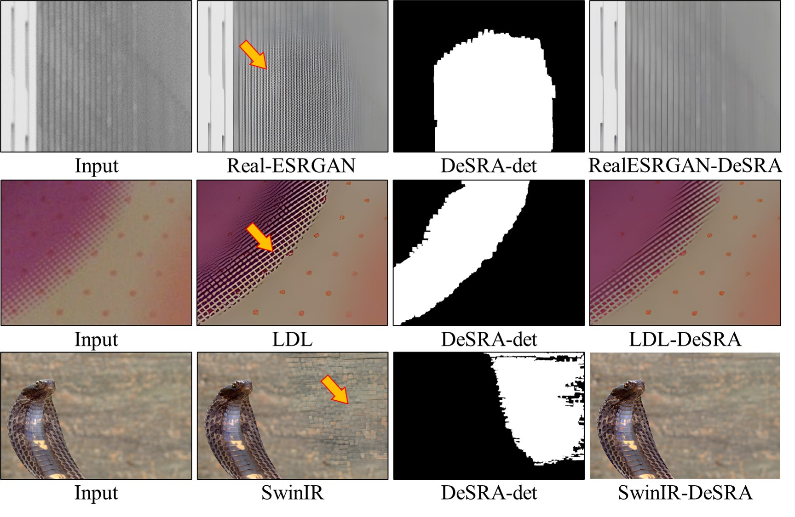

# DeSRA (ICML 2023)

🚩: The code and dataset will be released within this month.

---

This paper aims at **dealing with GAN-inference artifacts**.
 

We design a method to effectively detect regions with GAN-inference artifacts, and further propose a fine-tuning strategy that only requires a small number of artifact
images to eliminate the same kinds of artifacts, which bridges the gap of applying SR algorithms to practical scenarios.

---

### :book: DeSRA: Detect and Delete the Artifacts of GAN-based Real-World Super-Resolution Models

> [[Paper](https://openreview.net/pdf?id=M0bwbIl4Bl)] &emsp; [Project Page] &emsp; [[Video](https://recorder-v3.slideslive.com/#/share?share=82996&s=e6ebdd07-a83b-4f4b-8eab-a5f103c6c46b)] &emsp; [B站] &emsp; [[Poster](https://docs.google.com/presentation/d/18-kVUBRgGKF4JUrN253yURJGDKcFNpaB/edit?usp=drive_web&ouid=113023682396793851067&rtpof=true)] &emsp; [[PPT slides](https://docs.google.com/presentation/d/15zGKWNd6vPuGI-dMf0ZsGrfMnPhXO-8s/edit?rtpof=true)] 
> [Liangbin Xie*](https://liangbinxie.github.io/), [Xintao Wang*](https://xinntao.github.io/), [Xiangyu Chen*](https://chxy95.github.io/), [Gen Li](https://scholar.google.com/citations?user=jBxlX7oAAAAJ&hl=en), [Ying Shan](https://scholar.google.com/citations?user=4oXBp9UAAAAJ&hl=en), [Jiantao Zhou](https://www.fst.um.edu.mo/personal/jtzhou/), [Chao Dong](https://scholar.google.com.hk/citations?user=OSDCB0UAAAAJ)  
> Tencent ARC Lab; University of Macau; Shenzhen Institutes of Advanced Technology; Shanghai AI Lab

  

---

## :scroll: License and Acknowledgement

DeSRA is released under Apache License Version 2.0.

## BibTeX

    @article{xie2023desra,
        title={DeSRA: Detect and Delete the Artifacts of GAN-based Real-World Super-Resolution Models},
        author={Xie, Liangbin and Wang, Xintao and Chen, Xiangyu and Li, Gen and Shan, Ying and Zhou, Jiantao and Dong, Chao},
        year={2023}
    }

## :e-mail: Contact

If you have any question, please email `lb.xie@siat.ac.cn`.
